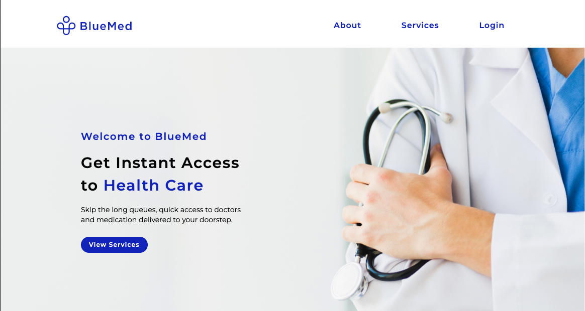
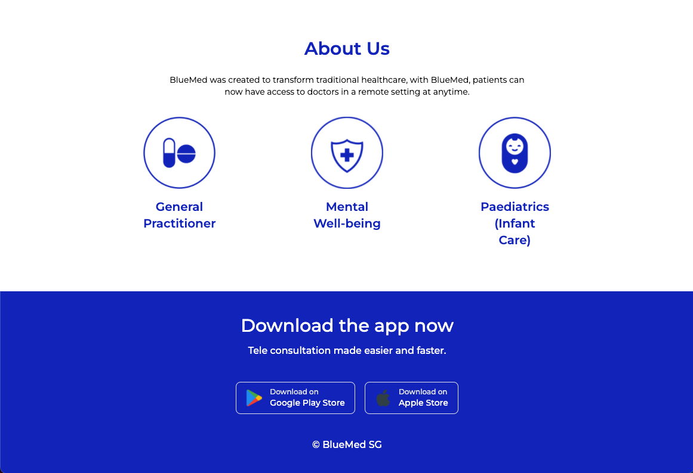
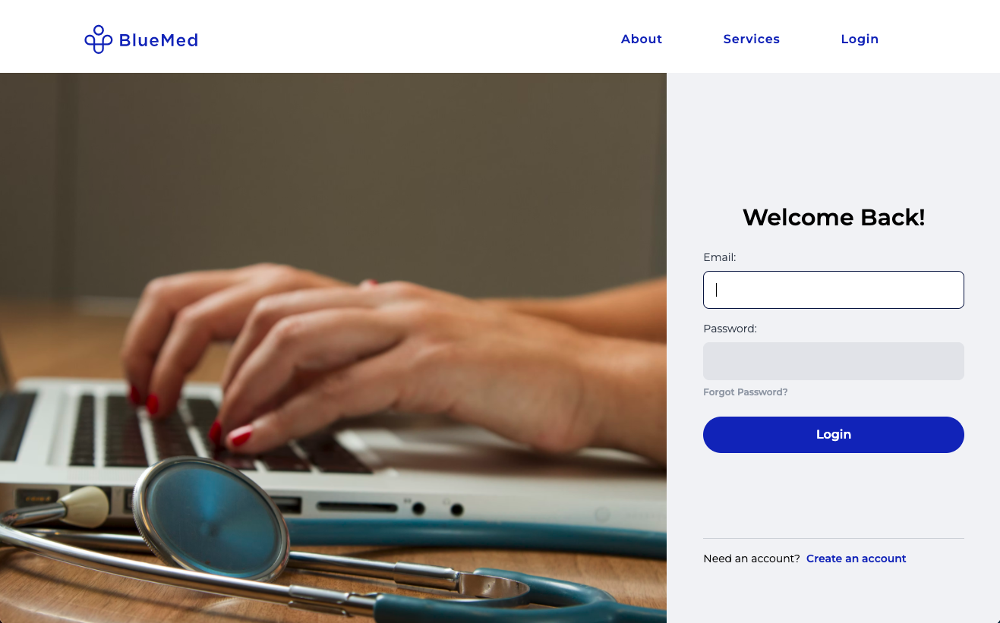
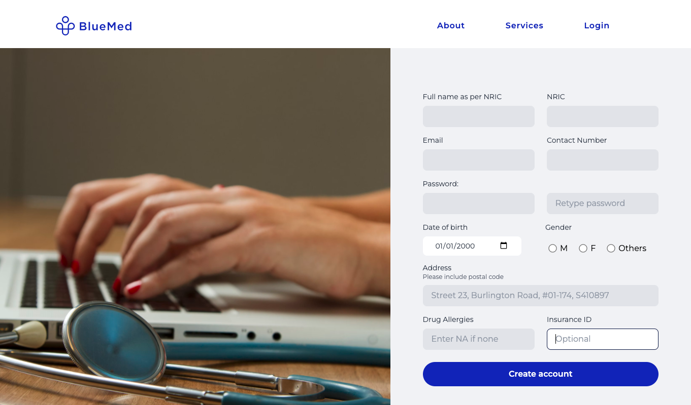
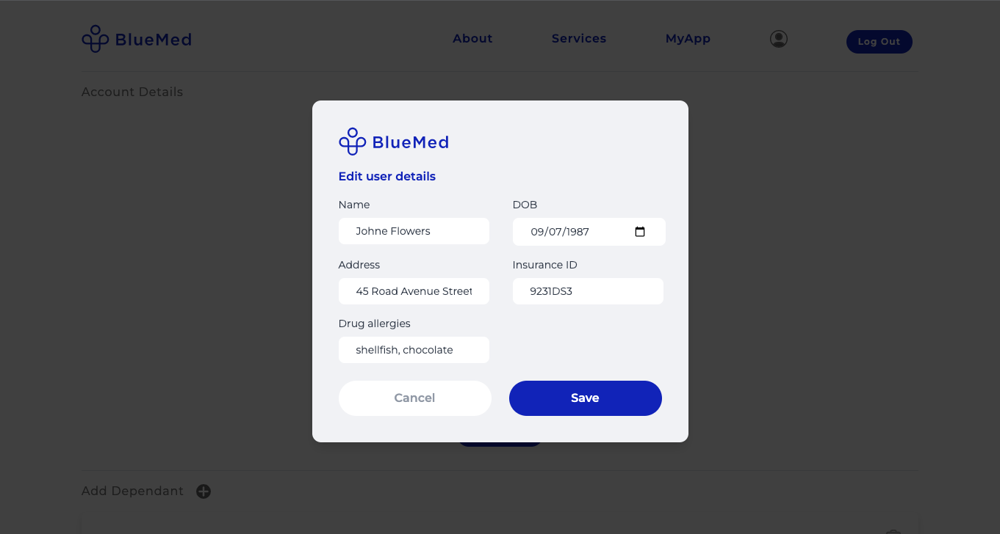
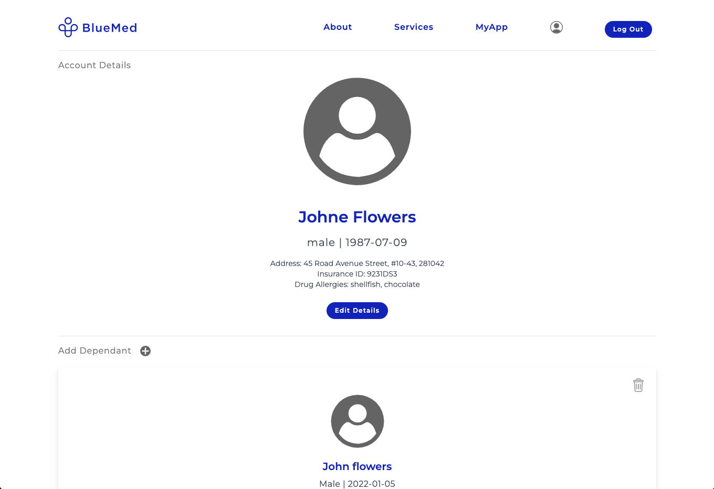
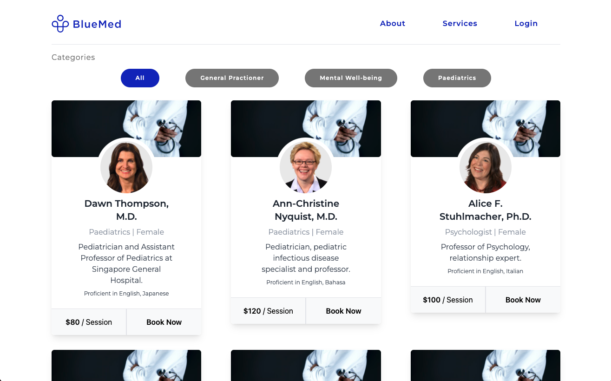
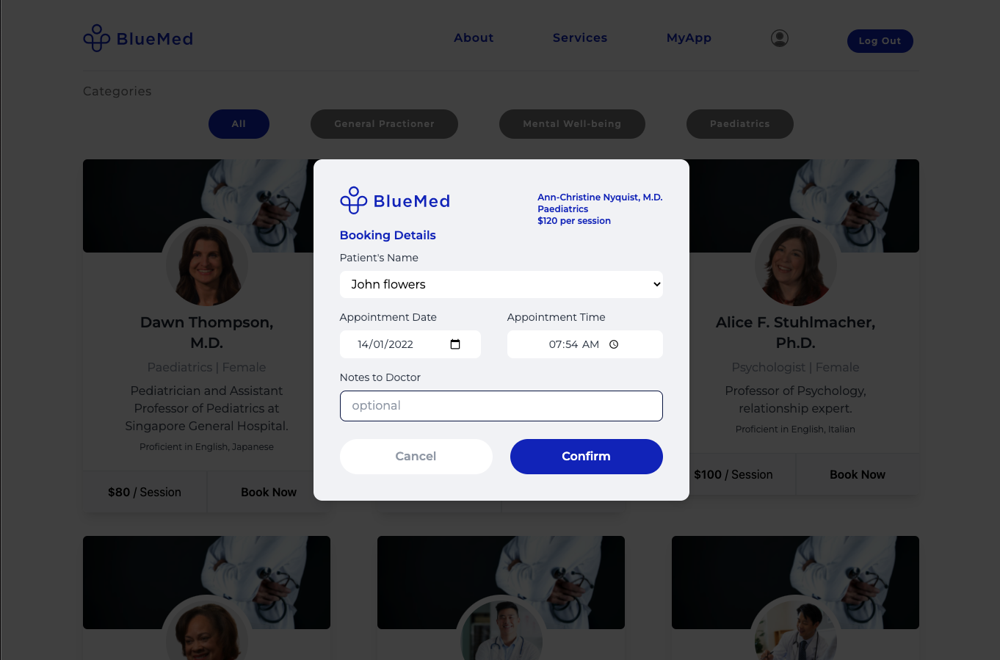
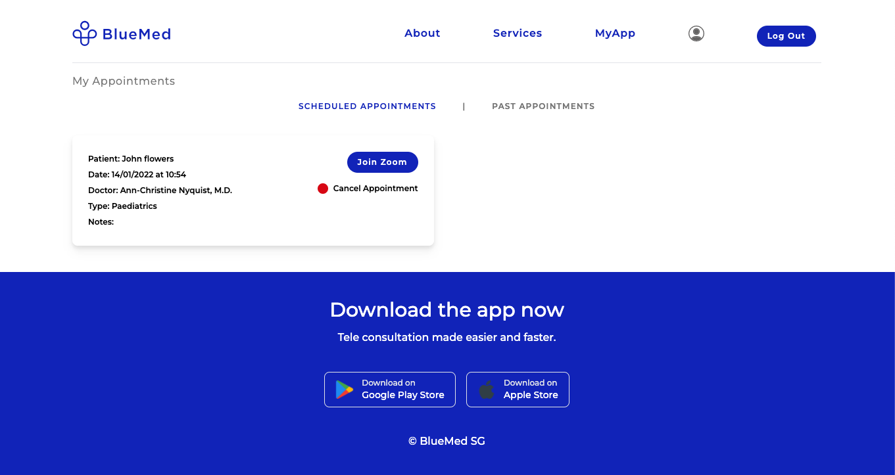
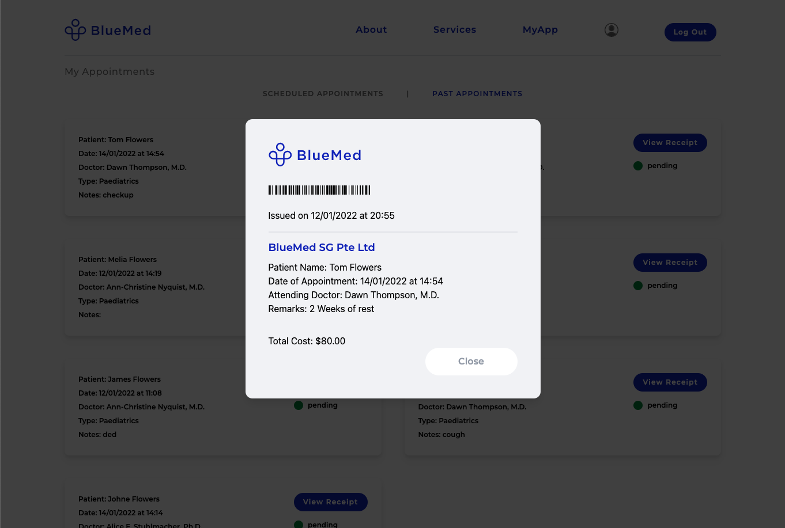

# SEI7 Project 3 - BlueMed
[Web App - Demo Links](https://bluemed-react.herokuapp.com/)

[Front Repo](https://github.com/faithchan/bluemed-frontend)

[Backend Repo](https://github.com/andrewilf/blue_med_backend)

## 💊 Introduction

BlueMed was created to meet the needs of an emerging rise of demand in the healthcare sector. With Covid-19, mandatory safety measures were implemented at spaces, this also resulted in longer waiting times, lesser manpower on shifts and more patients that needed to be treated. Hence, BlueMed was created to allow the use of digital and telecommunications technology to access health care services remotely.

## 🩺 Features

- Healthcare services focusing on Mental Wellbeing, Paediatrics and General Practition
- Users can sign up and select the type of service, the doctor they prefer, the time they wish to consult and the date of their own choice
- Users can also add a depandant, children under users will be able to use the services 
- Price of each session is clearly stated, so it helps Users to make informed decisions
- Flexibility, can't attend the appointment because of an emergency? Cancelation is immediate and can be performed by Users themselves
- Get your medicine delivered to your door step without needing to step out of the house and wait in line at clinics

## 👨‍👩‍👦‍👦 User Story

### 1. User
- **CREATE** Create an account with personal details // Create appointments for User // Create appointments for depandants
- **READ** View your account details // Dependant details // View available services // View available doctors// Scheduled and Past appointments of your own and your depandant only // View your receipt at the end of appointment 
- **UPDATE** Edit personal Details // Add a dependant // Update details about dependant
- **DELETE** Cancel appointments // Delete a dependant

### 2. Admin
- **READ** View ALL patient's Scheduled & Past appointments
- **UPDATE** Edit doctor's note by e.g giving mc // Change status of the appointment to completed
- **DELETE** Cancel appointments on behalf of any patient

## 🎨 Front-End

### Wireframes

<table><tr>
 <td>
  Landing page
</td>
 <td>
 
</td>
  <td>
 
</td>
 </tr>
  <tr>
 <td>
 Account
</td>
 <td>

</td>
<td>

</td>
<td>

</td>
<td>

</td>
 </tr>
  <tr>
 <td>
 Services 
</td>
 <td>
 
</td>
    <td>

</td>
 </tr>
  <tr>
 <td>
Appointments and receipt
</td>
 <td>
 
</td>
     <td>
 
</td>

 </tr>
 
   
</table>

## 💻 Technologies

### Front-End
- Tailwindcss
- React

### Back-End
- Node.js
- Express, express-session
- MongoDb/Mongoose

## Contributors
- Andrew @andrewilf
- Faith @faithchan
- Rosh @candontwork